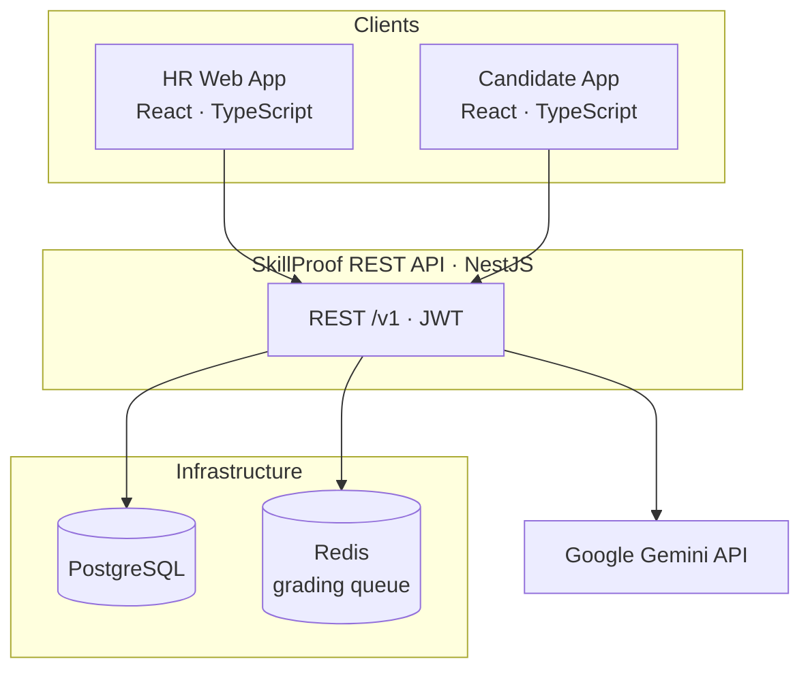

# SkillProof: Final Project Report

**Program:** ESCEN, AI for Impact · Boston LXP 2026 (Next-U)  
**Product:** SkillProof, verified junior tech hiring  
**Date:** June 2026  
**Team:** Alice MATHEY, Erwan HAMZA, Romain SADAR, Joris RABILLOUD

| | |
|---|---|
| **Tagline** | Too many applicants. Not enough proof. |
| **Live app** | https://skillproof-z3j9.onrender.com/ |
| **API** | https://skillproof-api-mxjo.onrender.com/v1 |
| **Repository** | https://github.com/WildBanhCuon/SkillProof |

---

## Executive summary

Junior tech roles attract hundreds of applications per posting, yet recruiters still decide who advances using CV proxies (school, keywords, and polished portfolios) that poorly predict on-the-job performance. SkillProof is a B2B SaaS that helps hiring teams in companies of roughly **50 to 500 employees** move from noisy applications to **verified, job-ready shortlists** in one workflow: improve the job ad, run a **role-specific assessment**, and review **rubric-backed evidence** for every candidate.

The **buyer** is the Head of Talent or HR lead; **daily users** are recruiters and hiring managers. Our functional prototype demonstrates the full chain (listing analysis, assessment generation, candidate practice and application tests, AI-assisted grading, and an HR results dashboard) deployed on Render with a React frontend and NestJS API backed by PostgreSQL, Redis, and **Google Gemini 3.1 Flash Lite**.

Commercially, SkillProof is positioned as a **wedge** between applicant tracking systems and the interview stage: we do not replace Greenhouse or Workable, but we own the step from “posted a junior role” to “here is who to interview, and why.” Revenue is modeled as a **monthly subscription** tiered by active job slots and graded candidate volume (€149 to €899 per month), anchored on recruiter labor saved rather than API cost.

This report documents the problem, solution, AI justification, technical implementation, market and business model, risks, and known limitations of the MVP. Success metrics (60 to 70% screening time reduction, improved interview-to-hire conversion) are **design targets** for pilots, not yet validated with production customers.

---

## 1. Problem and context

### 1.1 Why junior hiring breaks down

Junior tech hiring combines **high volume** with **low signal**. A single posting can receive **200 to 500+ applications** within days. At this career stage, CVs look interchangeable: similar bootcamps, tutorial projects, and keyword-stuffed profiles, often assisted by generative AI on the candidate side. Recruiters spend **an estimated 23 to 35 hours** per mid-volume hire on resume screening and preliminary phone screens alone; our pricing research uses a loaded cost of **€40 to 50 per hour**, implying **€800 to 1,575** of labor before structured skill proof exists.

The failure modes are structural:

1. **CVs do not predict ability.** Without a professional track record, “years of experience” and school prestige become default filters, which is both unfair and a weak predictor of performance.
2. **Job ads attract the wrong crowd.** Hiring managers often embed senior requirements in “junior” titles. HR sees the symptom (bad applications) without a lever to fix the cause (the listing).
3. **Mis-hires are expensive.** A bad junior hire can cost **6 to 9 months** of salary, onboarding, and management time before the mismatch is visible.
4. **No defensible audit trail.** When a hire fails or a rejected candidate challenges a decision, HR rarely has structured evidence tied to explicit criteria, which is an increasing concern for DE&I and internal review.

### 1.2 Primary persona: Marion, Head of Talent

Marion Lefebvre (persona, 34) leads talent at an **80-person B2B SaaS scale-up** in Paris. She receives **200+ applications** per junior role, estimates **~80% are low-quality or AI-inflated**, and faces pressure from her CTO for “juniors who deliver at a senior level.” She uses **Greenhouse**, LinkedIn Recruiter, and occasionally **Codility**, but finds full coding platforms heavy for every junior funnel.

**Job to be done:** *When I post a junior role and get flooded with applications, help me produce an interview-ready shortlist quickly, with evidence I can defend to hiring managers.*

### 1.3 Secondary persona: junior applicants

**Sofiane** (CS graduate) and **Camille** (career changer) represent candidates filtered by experience proxies and repetitive screens. SkillProof gives them a **role-specific test** and **structured feedback** when not selected, supporting employer brand and fairness, even though **HR is the paying customer**.

### 1.4 Why existing tools fall short

| Approach | Limitation for junior tech |
|----------|---------------------------|
| **ATS + AI resume screening** | Fast, but CV-centric; learns from historical hiring patterns; weak on role-specific proof |
| **Generic coding test platforms** | Tests exist, but often not generated from *this* job ad; annual lock-ins and per-candidate fees punish volume |
| **Manual screening** | Slow, inconsistent, hard to audit |
| **AI “match %” without rubrics** | Opaque scores that do not survive manager or compliance scrutiny |

SkillProof’s thesis: shift the question from *“Does this CV look good?”* to *“Can this person do this job?”* with cited evidence.

---

## 2. Solution overview

### 2.1 Product positioning

SkillProof is **not** a full ATS, job board, or enterprise HR suite. It is an **evaluation engine** in the hiring wedge:

```
Job ad quality  →  Role-specific assessment  →  Ranked shortlist with evidence
```

HR keeps their ATS; SkillProof handles **verification at scale** between application and interview.

### 2.2 Core workflow

**HR flow**

1. Register company account (demo: plan selection + simulated checkout).
2. Create or import a job posting; run **Check listing** for AI flags (overreach, vagueness, seniority mismatch) and a **skills matrix**.
3. Accept listing improvements; **publish** to generate a role-calibrated assessment (coding + multiple-choice questions).
4. Review **application-only** submissions on a ranked dashboard: dimension scores, recommendation band (`ready_now` / `trainable` / `at_risk`), strengths, risks, and summary.

**Candidate flow**

1. Browse published jobs; open a role.
2. Complete required profile fields before the real application test.
3. Optionally take a **practice test** (separate question set; company does not see results).
4. Complete the **application test**; submit triggers **batch grading**.
5. View results and feedback; receive notifications when HR advances or declines.

### 2.3 Design principles

1. **HR is the buyer.** Metrics and UX prioritize recruiter outcomes.
2. **AI is load-bearing.** Listing analysis, test generation, and grading are core loops, not decorative.
3. **Verify, don’t proxy.** Decisions grounded in rubrics and submissions, not keywords.
4. **Transparent to candidates.** Structured feedback where possible.
5. **Audit by default.** Gemini calls logged for traceability in the application audit log.

### 2.4 MVP scope and deliberate cuts

**In scope:** Multi-tenant companies; HR and candidate auth; job wizard and editor; real Gemini pipelines; practice vs application sessions; HR results and candidate notifications; demo subscription UX.

**Out of scope (documented cuts):**

- Full ATS integration (Greenhouse sync, etc.)
- Public job marketplace across employers
- Live code-execution sandbox (removed; see section 4.3)
- Real payment processing (Stripe)
- Skills Passport portability across employers
- Email notifications (partial / TBD)

The original four-week brief mentioned a single **Junior Frontend Developer** template; the build supports **any junior tech role** in copy and AI prompts, with seed data using one demo role for testing.

---

## 3. Why AI is necessary

### 3.1 What Gemini does in SkillProof

All production AI uses **Google Gemini 3.1 Flash Lite** with **structured JSON** outputs validated against schemas:

| Pipeline | Trigger | Output |
|----------|---------|--------|
| Company “About us” | HR onboarding / website URL | Team profile draft |
| Job wizard | Guided job creation | Job description + metadata |
| Listing check | HR clicks “Check listing” | Issues[], skills matrix |
| Listing rewrite | Accept / apply suggestions | Improved description |
| Assessment generation | Publish job | Questions (code + MCQ), rubrics |
| Session grading | Candidate submits application | Scores, dimensions, band, feedback |

**Human-in-the-loop:** HR approves listing changes, publishes roles, and makes final hire/interview decisions. AI does not autonomously reject candidates without HR review in the MVP.

### 3.2 Economic and quality argument

Without AI, a team cannot economically:

- Analyze messy job language and produce a **calibrated skills matrix** per role.
- Generate **fresh assessments** tied to each posting (not a static question bank).
- Apply **consistent rubric-based evaluation** across dozens of submissions per role.

Measured API cost (May 2026) is **~$0.0035 per job** (setup + check + publish) and **~$0.0006 per graded submission**, negligible compared with subscription revenue at pilot scale (see section 6.4).

### 3.3 Stress tests

**If frontier models were free tomorrow:** SkillProof still wins on **workflow embedding** (job-linked tests, practice/application separation, ranked evidence, and HR dashboard), not on API access alone.

**If AI were removed:** The product degrades to a manual test host without generation, listing intelligence, or scalable grading. It loses the core value proposition.

**If a non-AI competitor appears:** SkillProof competes on **role-specific assessment quality**, **transparent rubrics**, and **measurable screening time savings**, not on being the only product that calls an LLM.

### 3.4 Trade-off owned: quality at speed

We optimize for **decision-quality-at-speed**: automated first pass for volume, with architecture room for human review when model confidence is low (future enhancement). Grading runs **asynchronously on submit** (Bull queue + Redis) so candidates are not blocked on synchronous LLM latency.

---

## 4. Technical architecture and prototype

### 4.1 Stack

| Layer | Technology |
|-------|------------|
| Frontend | React 18, TypeScript, Vite, Tailwind CSS |
| Backend | NestJS, Prisma ORM |
| Database | PostgreSQL |
| Queue / cache | Redis, Bull (grading jobs) |
| AI | Google Gemini API (`gemini-3.1-flash-lite`) |
| Auth | JWT (access + refresh); HR vs candidate roles |
| Deployment | Render (`deploy` branch) |

### 4.2 High-level architecture

The system follows a classic three-tier layout: two React clients (HR and candidate) call a shared REST API, which persists data in PostgreSQL, offloads grading to a Redis-backed job queue, and calls Google Gemini for AI pipelines.

*Insert Figure 1 below after exporting the diagram (e.g. from [Mermaid Live Editor](https://mermaid.live)).*



**Multi-tenancy:** Each HR user belongs to a **Company**; jobs, assessments, and applications are scoped by `company_id`. Practice sessions are invisible to HR dashboards.

### 4.3 Grading implementation (current build)

On submit, the API enqueues a grading job. The grading service:

1. **Auto-scores MCQ** answers deterministically against stored correct option IDs.
2. **Calls Gemini** for code/text questions using submission + rubric context.
3. Persists dimension scores, overall score, recommendation band, strengths, improvements, and summary.
4. Creates an **Application** record for `application` sessions (not practice).

**Scope correction:** Early plans included a **Judge0 code sandbox** for executing candidate code. The shipped MVP **removed sandbox execution** entirely. Candidates submit code in an editor; **grading is AI-assisted against rubrics**, not pass/fail on hidden unit tests. This reduces infrastructure cost and complexity; we document it as a deliberate MVP trade-off. Live sandbox execution remains a **future option** if buyers require execution proof.

### 4.4 Key API surface

The public HTTP API is versioned under `/v1`. Representative capabilities:

- **Auth:** HR and candidate registration and login, profile updates, optional team profile generation from a company website URL.
- **Jobs:** Create and edit postings, listing check, apply AI suggestions, publish (triggers assessment generation), archive.
- **Sessions:** Start practice or application mode, save answers, submit (async grading), retrieve results.
- **HR results:** Job statistics, ranked candidates, per-candidate detail, interview or decline decisions.

Full route definitions and request/response shapes are available in the OpenAPI specification in the [GitHub repository](https://github.com/WildBanhCuon/SkillProof).

### 4.5 Security and privacy (MVP)

- API keys server-side only; candidates never receive hidden rubric secrets beyond public instructions.
- Answers capped at **12,000 characters** per code question (client and server enforced).
- Practice results **not visible** to the employer tenant.
- GDPR-aligned narrative (recommended for EU persona): candidate disclosure before AI evaluation, data minimization, retention policy TBD, human oversight on employment decisions.

---

## 5. Market and competitive landscape

### 5.1 Market structure (Porter’s five forces, summary)

| Force | Intensity | Implication for SkillProof |
|-------|-----------|----------------------------|
| Competitive rivalry | High | Many ATS + assessment + agency substitutes |
| New entrants | Medium to High | LLMs lower build cost; distribution and trust are barriers |
| Substitutes | High | Manual screen, agencies, generic tests, referrals |
| Buyer power | High | Pilots and ROI proof required |
| Supplier power | Medium to High | Concentration at LLM providers; mitigate via routing and abstraction |

**Win condition:** Not “we use AI,” but **faster defensible junior hiring decisions** with pilot metrics.

### 5.2 TAM / SAM / SOM (scenario-based)

Figures from team market research (mid-2026); **scenario assumptions**. Validate with primary research in pilots.

| Level | Definition | Estimate (ARR) |
|-------|------------|-----------------|
| **TAM** | Organizations globally hiring junior digital/tech talent with structured screening tools | ~$5.25B |
| **SAM** | Reachable wedge: companies 50-500 employees, junior tech hiring, EU + US English | ~$1.84B |
| **SOM** | 12-24 month obtainable share (focused GTM) | ~$9.2M |

Focus wedge: **junior tech hiring evidence**, not all HR software.

### 5.3 Competitor landscape

| Category | Examples | Indicative pricing | Gap SkillProof fills |
|----------|----------|-------------------|----------------------|
| ATS + screening tier | Workable, Recruitee | ~$270-600/mo; assessment often premium tier | Native assessments expensive or shallow |
| Coding tests | TestGorilla, HackerRank, Coderbyte | $1,620+/yr annual; $15/overage per attempt on some plans | Job-linked generation; predictable volume pricing |
| AI async video | Hireflix, Sapia | $75-400/mo | Less technical depth for dev roles |
| Manual | Spreadsheets + manager gut | Recruiter time | No scale, no audit trail |

**Differentiation:**

- One workflow: listing quality → assessment → ranked evidence.
- **Practice ≠ application** question sets (integrity).
- **Explainable rubrics**, not opaque resume match percentages.

---

## 6. Business model and go-to-market

### 6.1 Revenue model

**Monthly subscription** tiered by:

- **Active job slots** (concurrent published roles)
- **Graded candidates per month**
- **Unlimited recruiter / hiring-manager seats**

This aligns spend with hiring volume and avoids punitive per-candidate surprises at junior-role scale.

### 6.2 Pricing tiers (prototype)

| Tier | Target size | Monthly (EUR) | Active jobs | Graded / month |
|------|-------------|---------------|-------------|----------------|
| Starter | 20-50 emp | €149 | 2 | 100 |
| Growth | 50-100 emp | €299 | 5 | 300 |
| Scale | 100-250 emp | €549 | 10 | 800 |
| Pro | 250-500 emp | €899 | 20 | 2,000 |

Annual prepay (~20% discount) optional. Overage fees apply above quota (tiered per plan).

**Positioning:** Above lightweight tools that only capture video or MCQ; below full ATS transformation and legacy enterprise assessment contracts.

### 6.3 Willingness to pay

Customers fund SkillProof by reducing:

- Manual screening hours (recruiter + manager time).
- Fragmented point tools.
- Weak interviews with unqualified candidates.

**Cheapest validation:** **Paid pilots** (€500 to 1,500 for 2-4 weeks, one live role) measuring hours saved, shortlist quality, and pilot-to-paid conversion.

### 6.4 Unit economics (illustrative)

At **Growth** tier (€299/mo, 5 jobs, 300 graded candidates):

| Line | Estimate |
|------|----------|
| AI COGS | ~€0.25/mo (measured token usage + 15% buffer) |
| Infra COGS | ~€15-25/mo (shared hosting, DB, Redis) |
| Gross margin | **80%+** at quota (before sales/support/legal) |

Pricing is **value-anchored** (€800 to 1,575 labor per hire), not cost-plus on tokens.

### 6.5 First 100 customers (phased GTM)

| Phase | Target | Motion |
|-------|--------|--------|
| 0-20 | Design partners | Founder-led outbound, warm intros, paid pilots |
| 20-60 | Repeatable SMB | Case studies, LinkedIn proof, outbound |
| 60-100 | Scale wedge | Referrals, light partners; tighten ICP (50-500, junior tech) |

**Sales motion:** Hybrid **product-led + sales-assisted**: fast demo value, human help to close.

---

## 7. Risks, compliance, and mitigations

### 7.1 Risk register

| Risk | Type | Likelihood (1-5) | Impact | Mitigation |
|------|------|------------------|--------|------------|
| Low willingness to pay despite interest | Market | 4 | High | Paid pilots, ROI metrics, tiered pricing |
| AI quality / latency / cost drift | Technical | 3 | High | Schema validation, monitoring, retries, model abstraction |
| HR tool fatigue / “ATS is enough” | Adoption | 4 | Medium | Wedge positioning; job-linked proof vs resume AI |
| EU AI Act compliance burden | Regulatory | n/a | High | Human oversight, disclosure, documentation roadmap |
| Assessment gaming / cheating | Technical | 3 | Medium | Practice≠application; profile gates; future proctoring |

### 7.2 EU AI Act (employment AI)

Under **Annex III**, AI used for **recruitment and selection** of natural persons is **high-risk**. Obligations include risk management, data governance, technical documentation, logging, transparency to candidates, and **human oversight**. Enforcement timelines apply from **2026** onward for relevant systems.

**SkillProof stance for MVP:** Candidates should be informed that AI assists evaluation; HR retains hiring decisions; we log AI inputs/outputs for audit. Full conformity assessment and bias testing are **post-MVP** legal and product work. We do not claim full compliance in this school prototype.

### 7.3 Limitations we own (not excuses)

| Limitation | Next step |
|------------|-----------|
| English only | Phase 2 localization for EU markets |
| No ATS export yet | Build Greenhouse/Lever webhook or CSV export |
| AI grading without code execution | Re-evaluate sandbox if buyers require runtime proof |
| No production payment / billing | Integrate Stripe; persist plans server-side |
| Pilot metrics not yet measured | Run 5-10 paid pilots with before/after time tracking |
| Hallucination / grading variance | Expand eval set; human review queue on low confidence |

We do **not** claim production-grade fairness certification or enterprise SLA in this deliverable.

---

## 8. Conclusion and path forward

SkillProof addresses a concrete, recurring pain: **junior tech hiring at scale without verifiable skill signal.** Our MVP demonstrates an end-to-end, AI-native workflow from job ad improvement to ranked shortlist that incumbents only partially address. The business case rests on recruiter labor replaced and defensible hiring outcomes, supported by subscription pricing and strong unit economics at pilot scale.

**Immediate next steps:**

1. Run **paid pilots** with explicit metrics (time-to-shortlist, interview quality, conversion).
2. Prioritize **EU AI Act** and GDPR documentation for Marion’s segment.

We welcome jury questions on market sizing, AI necessity, economics, and the deliberate scope choices (including sandbox removal and demo billing) that shaped a shippable prototype in five weeks.

---

## References

- **Project source code and API specification:** https://github.com/WildBanhCuon/SkillProof  
- **Google Gemini API pricing:** https://ai.google.dev/gemini-api/docs/pricing  
- **EU AI Act (European Commission overview):** https://digital-strategy.ec.europa.eu/en/policies/regulatory-framework-ai  
