# SkillProof — Backend architecture

> **Status:** Confirmed design (team decisions May 2026)  
> Aligned with [mockups](../../mockups/) and [project brief](../brief/project%20brief.md)

---

## Confirmed decisions

| # | Topic | Decision |
|---|--------|----------|
| 1 | Candidate access | **C** — Candidate account; browse jobs and apply inside SkillProof |
| 2 | Code execution | **B** — Run submissions in a **code sandbox** (e.g. Judge0); results feed grading |
| 3 | Skills matrix | **A** — Computed **only** when HR clicks **Check listing** |
| 4 | AI suggestions | **B** — Gemini returns a full rewritten listing; HR **accepts in one click** |
| 5 | Grading timing | **A** — **Batch** on final **Submit** only (UI progress bars ≠ live AI) |
| 6 | Auth | **A** — Multi-tenant **Company** + HR users, **JWT** |
| 7 | Frontend | **Custom codebase** (not Lovable) — UI recreated from mockups, talks to REST API |
| 8 | LLM | **Google Gemini** for all AI pipelines + logged for audit trail |
| 9 | Apply vs practice | **Apply = test completed + submit as application.** Practice test allowed without apply → **company never sees** that result. **No external ATS.** |
| 10 | MVP depth | **All paths use real Gemini** (no seeded/fake AI responses) |

---

## What the backend must support

| Screen | User | Backend responsibility |
|--------|------|-------------------------|
| Create job posting | HR (JWT) | Draft listing, **Check listing** → issues + skills matrix, **Accept suggestions**, publish → generate assessment |
| Take assessment | Candidate (JWT) | Sandbox runs, save answers, timer; **practice** or **application** submit |
| Results dashboard | HR (JWT) | Only **application** submissions; rank, Gemini insights, stats |

**MVP scope:** Junior Frontend Developer template · no ATS · no marketplace.

---

## Architecture overview

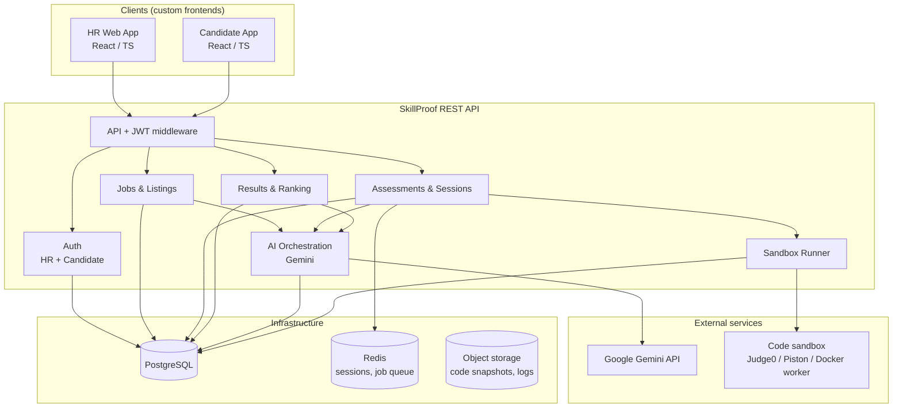

### Tech stack (recommended — frontend separate, backend TBD)

| Layer | Recommendation | Notes |
|--------|----------------|--------|
| **HR + Candidate UI** | React + TypeScript + Vite | Recreate [mockups](../../mockups/); call REST API |
| **API** | **NestJS** (TypeScript) | Team can pick; both fit Gemini + Judge0 |
| **Database** | PostgreSQL | Relational model below |
| **Cache / queue** | Redis | Sandbox job queue, rate limits, session TTL |
| **AI** | `google-generativeai` / Vertex AI | Structured JSON outputs per pipeline |
| **Sandbox** | Judge0 CE or self-hosted worker | Hidden tests per question; timeout per run |
| **Auth** | JWT (access + refresh); `company_id` on HR claims | Separate candidate auth namespace |

Lovable is **not** used in production — mockups are the UI spec only.

---

## Candidate journeys: practice vs apply

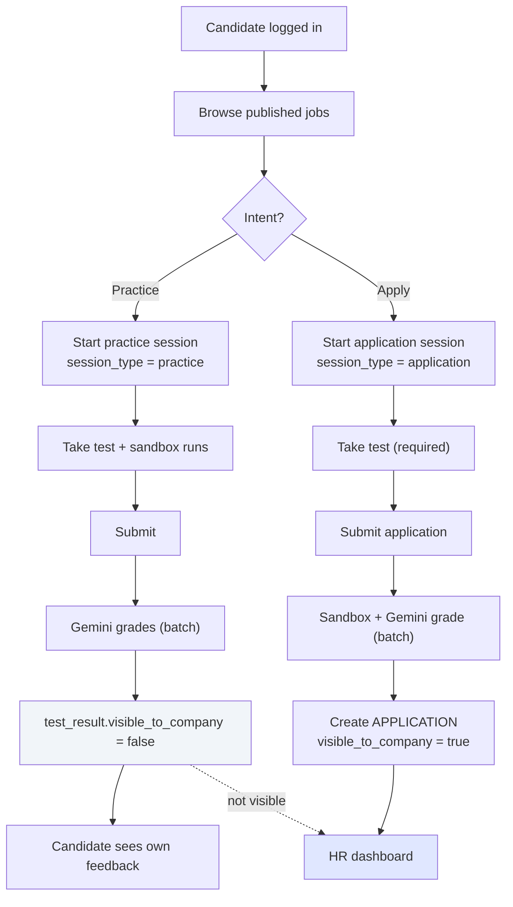

**Rules**

- An **application** only exists after the candidate **submits the test** and chooses **Submit application** (not practice).
- **Practice** sessions are tied to `candidate_user` + `job_posting` but have **no** `application` row and **`visible_to_company = false`**.
- HR dashboard queries **only** results where `visible_to_company = true`.
- No CV upload, no ATS sync — SkillProof is the sole funnel for this MVP.

---

## Flow A — HR: create → check → accept → publish

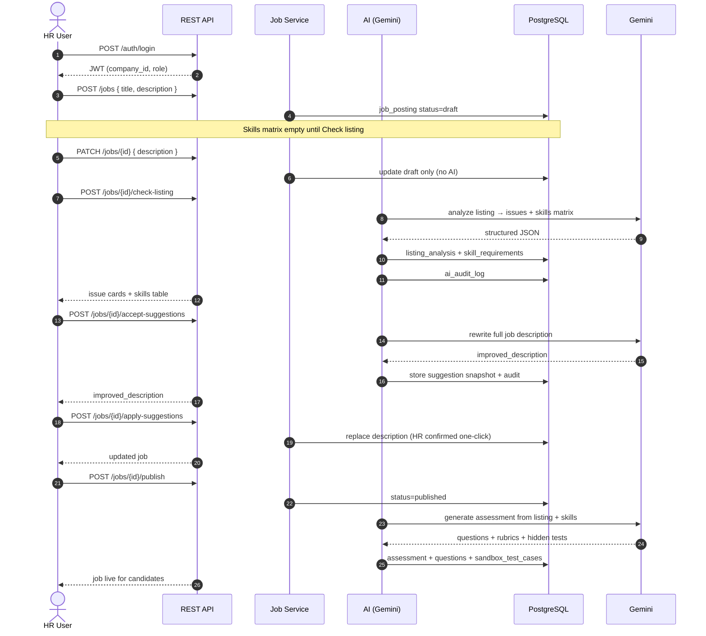

**Skills matrix:** populated **only** at step 5 (`check-listing`). Re-run check after major edits.

---

## Flow B — Candidate: practice or apply + sandbox + batch grade

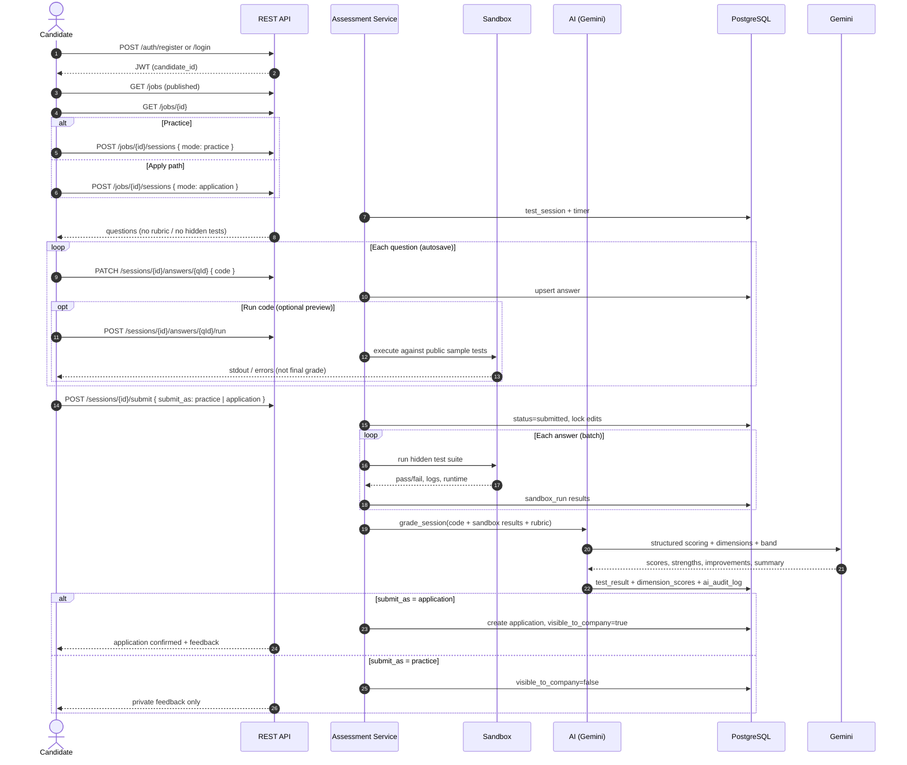

**Grading (5A):** Gemini runs **once per session** on submit, using sandbox outcomes + code + rubric. UI “What we evaluate” bars are **static or post-submit** — not live AI during the test.

---

## Flow C — HR: dashboard (applications only)

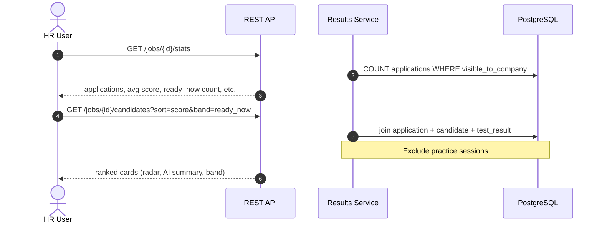

**Dashboard metrics (revised for decision 9)**

| Metric | Definition |
|--------|------------|
| Applications received | Candidates who **submitted test as application** |
| Tests completed | Same as applications in MVP (apply requires test) |
| Verified matches | Applications with `match_percent` ≥ threshold |
| Top performers | Applications with `recommendation = ready_now` |

Practice attempts are **excluded** from HR stats (optional separate analytics later for product, not HR UI).

---

## Grading pipeline (sandbox + Gemini)

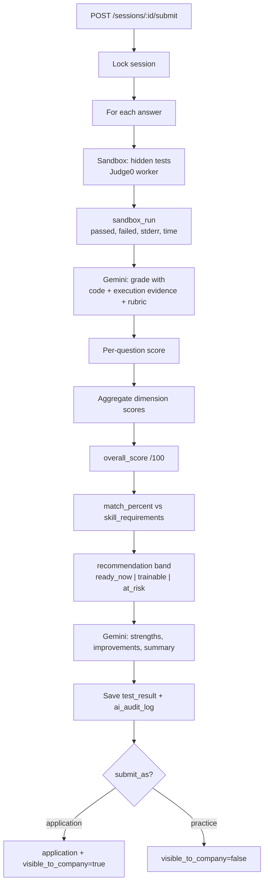

---

## AI orchestration (Gemini — all real)

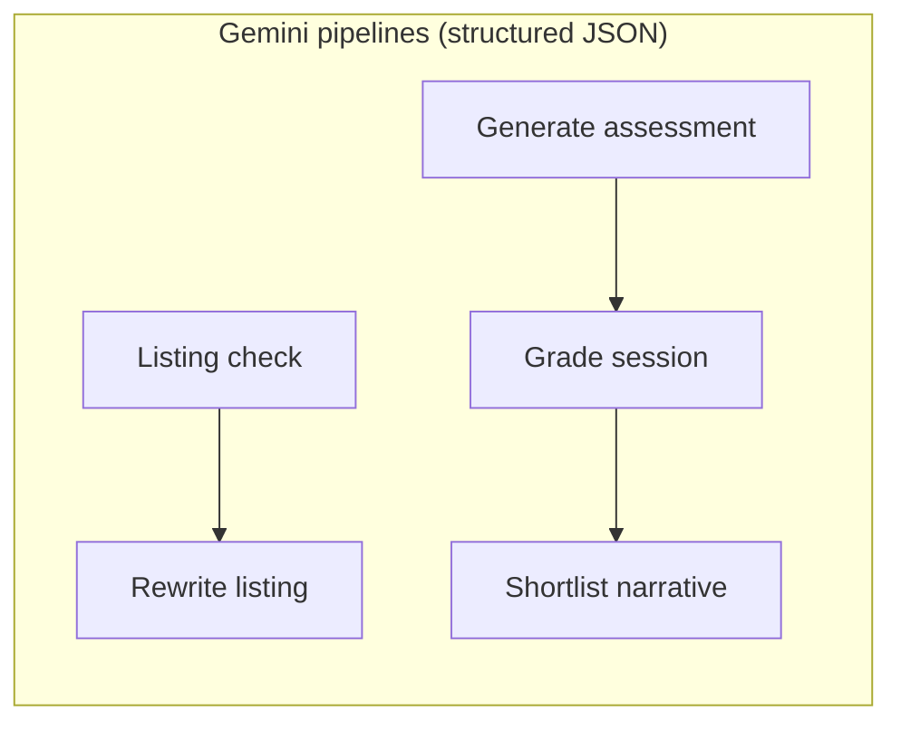

| Pipeline | Trigger | Gemini output |
|----------|---------|----------------|
| Listing check | `POST /jobs/:id/check-listing` | `issues[]`, `skills[]` |
| Rewrite listing | `POST /jobs/:id/accept-suggestions` | `improved_description` (markdown/HTML) |
| Generate assessment | `POST /jobs/:id/publish` | `questions[]`, `rubrics`, starter code |
| Grade session | `POST /sessions/:id/submit` | scores, dimensions, band, feedback |
| Shortlist narrative | Part of grade or `GET` refresh | strengths, improvements, one-line summary |

Every call writes to **`ai_audit_log`** (prompt hash, model, request/response JSON, `job_id` / `session_id`) for the brief’s **decision trail**.

---

## Core data model

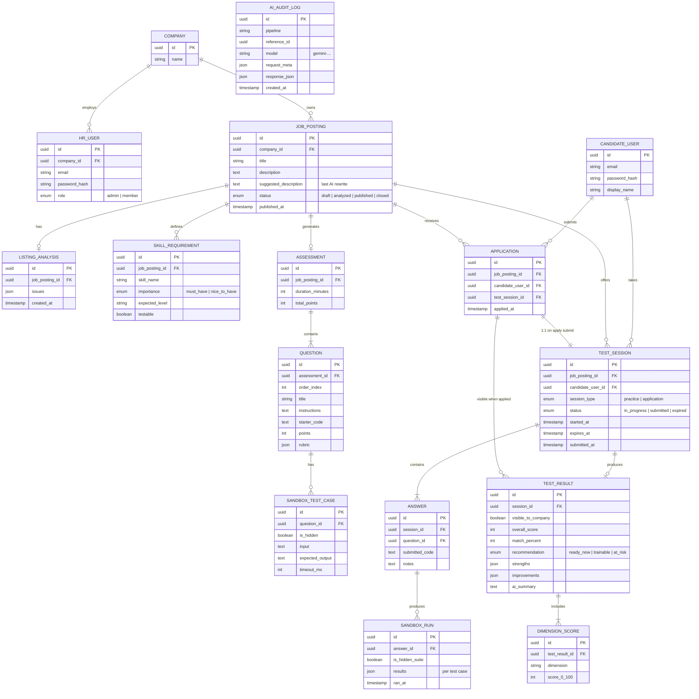

---

## REST API surface

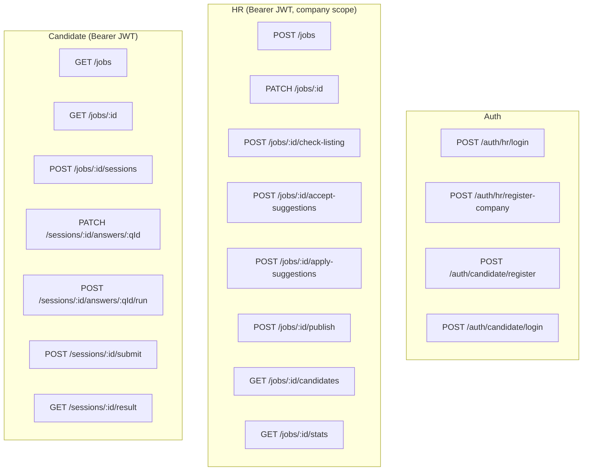

---

## Job posting state machine

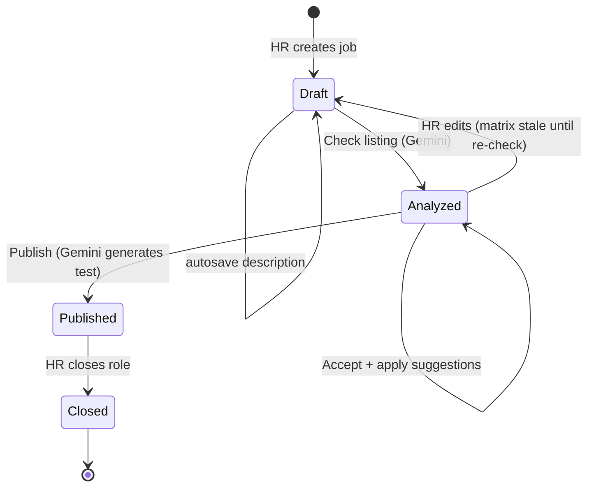

---

## Frontend ↔ backend integration

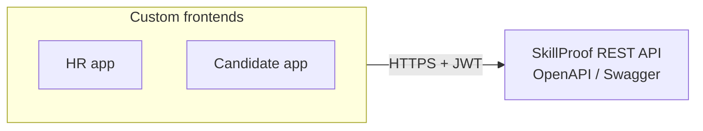

- Recreate three mockup flows in code; no Lovable runtime dependency.
- Shared API client (generated from OpenAPI optional).
- CORS configured for dev/staging origins.

---

## Security & tenancy notes

- HR JWT includes `company_id`; every `/jobs/*` query scoped to tenant.
- Candidates only access their own `sessions` and `results`.
- Hidden sandbox tests never sent to client — only `run` uses public sample cases.
- Rate-limit Gemini and sandbox per company/session.
- Store `GEMINI_API_KEY` server-side only.

---

## Implementation order (suggested)

1. PostgreSQL schema + HR/candidate auth (JWT)  
2. Jobs CRUD + `check-listing` + `accept/apply-suggestions` (Gemini)  
3. `publish` → assessment generation (Gemini)  
4. Sandbox worker + `run` + hidden tests on submit  
5. Submit flow (practice vs application) + grade (Gemini)  
6. HR candidates + stats endpoints  
7. Wire custom React apps to API  

---

## Brief vs sandbox (note for pitch)

The [project brief](../brief/project%20brief.md) lists “no live code-execution sandbox” for the **4-week story MVP**. Your team chose **real sandbox execution (2B)** for the functional build — stronger demo, higher engineering cost. Mention this explicitly in the report as a deliberate scope upgrade.
