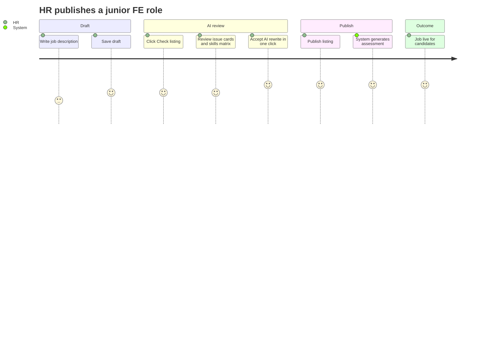
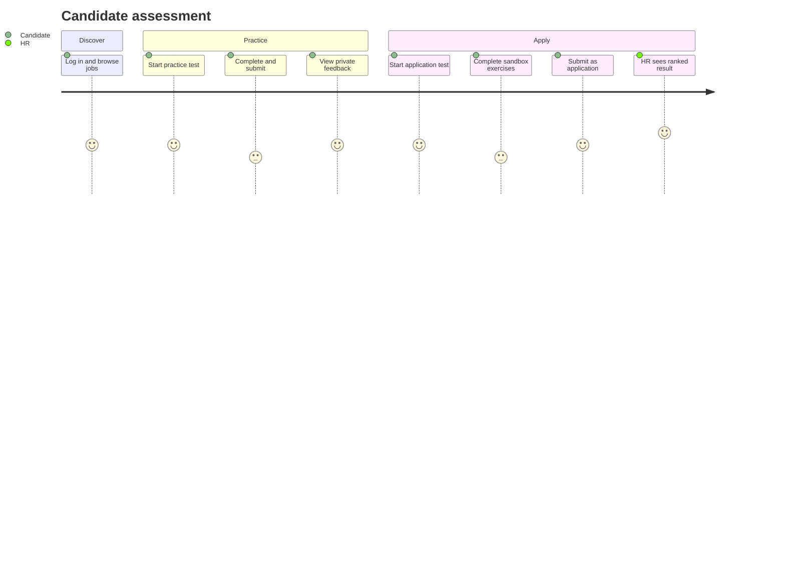
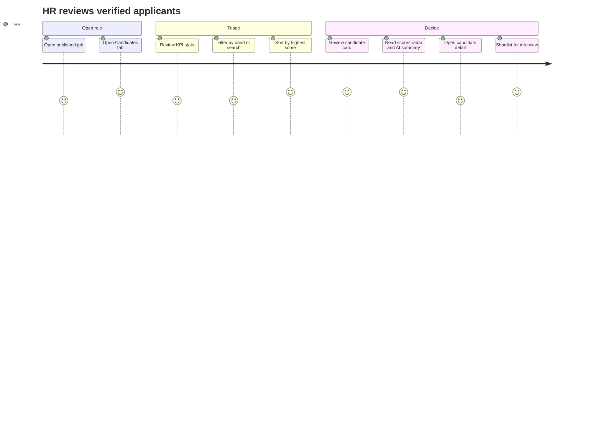

# SkillProof — Product Requirements Document (PRD)

| Field | Value |
|--------|--------|
| **Product** | SkillProof |
| **Version** | MVP 1.0 (course prototype) |
| **Status** | Draft — core decisions locked in [§6.4](#64-confirmed-product-decisions); open items in [§14](#14-open-questions) |
| **Last updated** | May 2026 |
| **Theme** | Education & Workforce Development (ESCEN — AI for Impact, Boston LXP) |
| **Related docs** | [Project brief](../brief/project%20brief.md) · [Personas](../brief/project%20personas.md) · [Backend architecture](../architecture/backend-architecture.md) · [UI mockups](../../mockups/) |

---

## 1. Executive summary

**SkillProof** is a B2B SaaS that helps companies hire **junior tech talent** using **verified skills** instead of CV proxies. HR teams improve job listings with AI, publish a role-calibrated technical assessment, and review a ranked shortlist backed by test evidence and an audit-friendly decision trail.

**MVP focus:** A single role template — **Junior Frontend Developer** — end-to-end: better job ad → auto-generated test → ranked applicants.

**Build target:** Functional prototype for a 5-week school project (investor-style pitch + demo). Custom React frontends, REST API backend, **Google Gemini** for all AI, **code sandbox** for grading, no external ATS.

---

## 2. Background & context

### 2.1 Business problem

Junior tech hiring is high-volume and low-signal:

- Hundreds of applications per posting; CVs look alike.
- CVs poorly predict ability at junior level.
- Job ads often mix junior titles with senior requirements (“junior senior”).
- Bad hires are expensive; screening is slow and subjective.
- HR lacks a defensible record of why candidates were advanced or rejected.

### 2.2 Why now

Large language models can analyze job language, generate calibrated assessments, and evaluate submissions at a cost below manual recruiter time — making **verification at scale** feasible for the first time. See [project brief § Why now](../brief/project%20brief.md).

### 2.3 Course alignment

Deliverables for **AI for Impact**:

| Deliverable | How SkillProof addresses it |
|-------------|------------------------------|
| Real problem + AI necessity | Hiring judgment is ambiguous; AI does extraction, generation, and evaluation |
| Functional tech prototype | API + sandbox + Gemini pipelines |
| Business case | B2B SaaS, HR buyer, metrics in §5 |
| 10–15 page report + 10 min pitch | PRD + architecture support narrative |

---

## 3. Product vision & principles

### 3.1 Vision

Replace junior hiring’s CV-sorting step with **evidence-based screening** that is faster for HR, fairer for candidates, and defensible for the organization.

### 3.2 Design principles

1. **HR is the buyer** — Primary UX and metrics serve the recruiter; candidate experience supports employer brand and fairness.
2. **AI is load-bearing** — Listing analysis, test generation, and grading are core loops, not decorative (see course “AI justification”).
3. **Verify, don’t proxy** — Decisions grounded in test results and rubrics, not school name or keyword matching.
4. **Transparent to candidates when possible** — Structured feedback after tests; practice mode without penalizing exploration.
5. **Audit by default** — Log AI inputs/outputs for shortlist decisions (DE&I and internal review).

### 3.3 Positioning (MVP)

| Dimension | SkillProof MVP |
|-----------|----------------|
| Segment | Junior frontend developer hiring |
| Buyer | HR / Talent Acquisition at tech companies |
| Alternative tools | Manual CV screen, Codility (heavy), ATS keyword filters |
| Differentiator | Job-ad improvement + ad-linked test + ranked evidence shortlist in one flow |

---

## 4. Users & personas

### 4.1 Primary persona — HR buyer (Marion)

**Role:** Head of Talent / HR Manager at a scale-up or mid-market tech company.

**Goals:** Hire juniors who last; cut screening time; defend realistic job ads to hiring managers; reduce first-year turnover.

**Key quote:** *“I spend two weeks filtering noise per role.”*

**Success with SkillProof:** Publish a cleaned listing and assessment in &lt;10 minutes; review a ranked shortlist in minutes, not days.

→ Full profile: [Marion — project personas](../brief/project%20personas.md)

### 4.2 Secondary personas — Candidates (Sofiane, Camille)

**Goals:** Prove real ability beyond CV; understand rejections; avoid repeating tests for every company.

**SkillProof MVP delivers:** Account-based apply flow, practice tests, post-submit feedback on their results. *(Portable “Skills Passport” across employers is a future vision — not MVP.)*

### 4.3 User roles in the product

| Role | Authentication | Primary surfaces |
|------|----------------|------------------|
| **HR Admin / Member** | JWT (company-scoped) | Job studio, publish, candidates dashboard |
| **Candidate** | JWT (individual) | Job browse, practice test, apply + test |

---

## 5. Goals & success metrics

### 5.1 MVP success (demo / course)

| # | Criterion | Measurable signal |
|---|-----------|-------------------|
| G1 | HR can improve a vague junior FE job ad with AI | Check listing → issues + skills matrix → accept rewrite |
| G2 | HR can publish ad + auto-generated assessment | Publish returns live job + N questions |
| G3 | Candidate can practice or apply via test | Practice hidden from HR; apply visible on dashboard |
| G4 | HR sees ranked applicants with AI insights | Sort by score; bands Ready / Trainable / At risk |
| G5 | End-to-end uses real AI | All Gemini pipelines live (no fake AI data) |

### 5.2 North-star metrics (product pitch — post-MVP)

| Metric | Target (from brief) |
|--------|---------------------|
| Screening time per junior role | −60–70% |
| Interview-to-hire conversion | +30% |
| Mis-hires at 3–6 months | Reduction (longitudinal) |
| Time-to-fill | Reduction |

### 5.3 MVP does not require

Validated production metrics, paid customers, or longitudinal hire outcomes — only a credible path to them in the pitch.

---

## 6. Scope

### 6.1 In scope (MVP 1.0)

- Multi-tenant **Company** + **HR users** (JWT).
- **Candidate accounts** (register / login).
- Job posting lifecycle: **draft → check listing → accept suggestions → publish**.
- **Skills matrix** only on “Check listing” (Gemini).
- **Apply suggestions** — HR accepts Gemini rewrite in one click (updates job description).
- **Assessment generation** on publish (Gemini), junior frontend template.
- **Technical test** with code editor, timer, multi-question flow.
- **Code sandbox** execution (e.g. Judge0) + **batch grading** on submit (Gemini).
- **Practice test** (results private) vs **application** (results visible to HR).
- **HR dashboard**: stats, filters, ranked candidate cards, dimension radar, AI summary.
- **AI audit log** for hiring decisions.
- **English** UI throughout.
- Custom **React/TypeScript** frontends (mockups as spec); **REST API** backend.

### 6.2 Out of scope (MVP 1.0)

| Item | Notes |
|------|--------|
| Job marketplace / public job board beyond company postings | No cross-company discovery engine |
| ATS integrations (Greenhouse, etc.) | No sync |
| Multi-role test templates | Only Junior Frontend Developer |
| CV upload / parsing | Apply = complete test only |
| Live AI scoring during test | Batch on submit only |
| Billing / subscriptions | Business model story only |
| Mobile-native apps | Desktop web first |
| Skills Passport portability across employers | Future |
| Email notifications | TBD — see open questions |

### 6.3 Deliberate scope upgrade (vs original brief)

Original brief listed “no live code sandbox” for the story MVP. **Confirmed build includes sandbox execution** for stronger verification — document as intentional upgrade in the report. See [backend architecture](../architecture/backend-architecture.md).

### 6.4 Confirmed product decisions

Locked for MVP (details in [backend architecture](../architecture/backend-architecture.md)):

| Topic | Decision |
|--------|----------|
| Candidate access | Accounts; browse and apply inside SkillProof |
| Code execution | Sandbox (e.g. Judge0) + Gemini grading |
| Skills matrix | Only after **Check listing** |
| Listing rewrite | Gemini full rewrite → HR **Apply suggestions** in one click |
| Grading | Batch on **Submit** only |
| Auth | Company + HR JWT; separate candidate JWT |
| Apply vs practice | Apply requires completed test + submit as application; practice results hidden from HR |
| AI | Google Gemini, all pipelines real |
| ATS | None |

---

## 7. User journeys

Three end-to-end paths cover the MVP. Satisfaction scores (1–5) are illustrative for journey maps.

| Journey | Actor | Outcome |
|---------|--------|---------|
| [7.1](#71-hr--create-and-publish-a-role) | HR | Published job + generated assessment |
| [7.2](#72-candidate--practice-vs-apply) | Candidate (+ HR on apply) | Practice feedback private, or application visible to HR |
| [7.3](#73-hr--review-shortlist) | HR | Ranked shortlist from verified tests |

### 7.1 HR — Create and publish a role

### 7.2 Candidate — Practice vs apply

### 7.3 HR — Review shortlist

**Steps (detail)**

1. Open published job → **Candidates** tab.
2. See aggregate stats: applications received, verified matches, top performers *(applications only — practice tests excluded; no separate “tests completed” metric in MVP)*.
3. Filter by band (**Ready now** / **Trainable** / **At risk**) or search by name.
4. Sort by highest score (default); top match visually emphasized.
5. Review candidate card: overall score, match %, dimension radar, strengths, areas to improve, AI recommendation.
6. Open **View details** for per-question breakdown and audit trail *(Should for MVP)*.
7. Use evidence for interview decision *(scheduling out of scope)*.

---

## 8. Functional requirements

Requirements use **Must** (MVP) and **Should** (if time permits).

### 8.1 Authentication & tenancy

| ID | Requirement | Priority |
|----|-------------|----------|
| AUTH-1 | HR can register a company and create HR users | Must |
| AUTH-2 | HR login returns JWT scoped to `company_id` | Must |
| AUTH-3 | Candidate can register and log in | Must |
| AUTH-4 | API enforces tenant isolation for all HR resources | Must |
| AUTH-5 | Password reset / email verification | Should |

### 8.2 Job posting studio (HR)

| ID | Requirement | Priority |
|----|-------------|----------|
| JOB-1 | Create job posting in `draft` with title + rich description | Must |
| JOB-2 | Autosave description while editing | Should |
| JOB-3 | **Check listing** calls Gemini → issue cards (type, message, severity, excerpt) | Must |
| JOB-4 | **Check listing** populates **skills matrix** (skill, importance, level, testable) | Must |
| JOB-5 | Skills matrix not updated until Check listing is run again after major edits | Must |
| JOB-6 | **Accept suggestions** returns full rewritten description (Gemini) | Must |
| JOB-7 | **Apply suggestions** replaces description in one click | Must |
| JOB-8 | **Publish** sets status `published` and triggers assessment generation | Must |
| JOB-9 | HR cannot publish without at least one successful Check listing | Should |
| JOB-10 | Close / archive published job | Should |

**Issue types (examples):** unrealistic seniority, vague responsibilities, too many mandatory skills, inconsistent junior/senior stack.

### 8.3 Assessment generation

| ID | Requirement | Priority |
|----|-------------|----------|
| ASSESS-1 | On publish, Gemini generates questions from listing + skills matrix | Must |
| ASSESS-2 | Each question: title, instructions, starter code, points, rubric | Must |
| ASSESS-3 | Hidden sandbox test cases per question for grading | Must |
| ASSESS-4 | Assessment metadata: duration (~90 min), question count, total points | Must |
| ASSESS-5 | Public sample test cases for optional “Run code” during test | Should |

### 8.4 Candidate — Jobs & sessions

| ID | Requirement | Priority |
|----|-------------|----------|
| CAND-1 | List published jobs for application | Must |
| CAND-2 | View job detail (description, company, assessment meta) | Must |
| CAND-3 | Start session in `practice` or `application` mode | Must |
| CAND-4 | Session timer; expire after configured duration | Must |
| CAND-5 | Navigate questions; autosave code per question | Must |
| CAND-6 | Optional **Run code** against public tests (sandbox) | Should |
| CAND-7 | **Submit** locks session and triggers batch sandbox + Gemini grade | Must |
| CAND-8 | Session mode set at start (`practice` \| `application`); **Submit** finalizes that mode (application submit creates `Application`) | Must |
| CAND-9 | Practice results: `visible_to_company = false` | Must |
| CAND-10 | Application results: create `Application` row, visible to HR | Must |
| CAND-11 | Candidate can view own result (scores, feedback) after submit | Must |
| CAND-12 | Candidate cannot apply without completing and submitting the test | Must |

### 8.5 Grading & AI evaluation

| ID | Requirement | Priority |
|----|-------------|----------|
| GRADE-1 | On submit, run hidden sandbox suite per answer | Must |
| GRADE-2 | Gemini grades using code + sandbox results + rubric (structured JSON) | Must |
| GRADE-3 | Output: overall score (/100), match %, 4 dimension scores | Must |
| GRADE-4 | Output: recommendation band — `ready_now` \| `trainable` \| `at_risk` | Must |
| GRADE-5 | Output: strengths[], improvements[], one-line AI summary | Must |
| GRADE-6 | Persist full pipeline in `ai_audit_log` | Must |
| GRADE-7 | UI “What we evaluate” bars may be static or post-submit only (not live AI) | Must |

**Dimensions:** Technical, Problem solving, Code quality, Communication.

### 8.6 HR — Results dashboard

| ID | Requirement | Priority |
|----|-------------|----------|
| DASH-1 | Show stats: applications received, verified matches, top performers | Must |
| DASH-2 | All dashboard metrics count **application** submissions only (exclude practice); *applications received* equals completed apply+test submits in MVP | Must |
| DASH-3 | List candidates sorted by score (default) | Must |
| DASH-4 | Filter by recommendation band | Must |
| DASH-5 | Search by candidate name | Should |
| DASH-6 | Candidate card: profile, score, match %, radar chart, strengths, improvements, band, summary | Must |
| DASH-7 | Top match visual emphasis on highest scorer | Should |
| DASH-8 | Pagination for long lists | Should |
| DASH-9 | Candidate detail view (per-question breakdown) | Should |

### 8.7 AI audit & compliance narrative

| ID | Requirement | Priority |
|----|-------------|----------|
| AUDIT-1 | Log every Gemini call: pipeline name, reference IDs, model, request/response | Must |
| AUDIT-2 | HR can trace shortlist decision to test result + audit entries | Should |
| AUDIT-3 | Export audit slice for a candidate (JSON or PDF) | Could |

---

## 9. Non-functional requirements

| Category | Requirement |
|----------|-------------|
| **Performance** | Check listing &lt; 30s p95; submit grading &lt; 120s p95 for 4-question test |
| **Availability** | Best-effort for course demo (single environment) |
| **Security** | API keys server-side only; hidden tests never exposed to client |
| **Privacy** | Practice results not visible cross-tenant; GDPR narrative in report (retention TBD) |
| **Accessibility** | WCAG 2.1 AA on critical flows (Should for MVP) |
| **Browser** | Latest Chrome / Edge / Firefox desktop |
| **i18n** | English only MVP |
| **Observability** | Structured logs for API, sandbox jobs, Gemini errors |

---

## 10. AI requirements (Gemini)

All pipelines use **real Gemini** with **structured JSON** outputs and schema validation.

| Pipeline | Input | Output | User trigger |
|----------|-------|--------|--------------|
| Listing check | Title + description | `issues[]`, `skills[]` | Check listing |
| Listing rewrite | Title + description + issues | `improved_description` | Accept suggestions → Apply suggestions |
| Assessment gen | Description + skills + role template | `questions[]`, rubrics, tests | Publish |
| Session grade | Answers + sandbox results + rubrics | Scores, band, feedback | Submit test |

**AI necessity (pitch):** Without AI, recruiters cannot economically analyze 200+ CV-like applications, generate role-specific coding tasks, or produce consistent rubric-based evaluations at scale.

**Failure handling:** If Gemini fails, show actionable error; do not silently fall back to fake scores.

Technical detail: [backend-architecture.md](../architecture/backend-architecture.md).

---

## 11. UI / UX requirements

Based on [mockups](../../mockups/) (English UI):

| Screen | Key elements |
|--------|----------------|
| **Create job posting** | Rich editor, Check listing CTA, skills matrix *(after check only)*, Save draft / Publish |
| **Take assessment** | Timer, question sidebar, instructions + code editor, Previous/Next, Submit |
| **See candidates** | KPI cards, band tabs, search/sort, candidate cards with radar + AI recommendation |

**Design system:** Indigo primary (`#4F46E5`), semantic green/orange/red, Inter, 8px radius, card layout — see [Lovable mockups prompt](../design/Lovable%20mockups%20prompt.md) for tokens.

**Applications:** One SPA with role-based routes **or** two apps (HR / Candidate) — see open questions.

---

## 12. Technical constraints

| Layer | Decision / recommendation |
|-------|---------------------------|
| Frontend | React + TypeScript + Vite (recreate mockups, not Lovable) |
| Backend | REST API — NestJS (team TBD) |
| Database | PostgreSQL |
| Cache / queue | Redis (sandbox jobs, sessions) |
| AI | Google Gemini API |
| Sandbox | Judge0 CE or equivalent |
| Auth | JWT (HR + candidate namespaces) |

No external ATS. No Lovable in production path.

---

## 13. Release plan (5-week course)

Suggested phases — adjust to your syllabus dates.

| Week | Focus | Exit criteria |
|------|--------|----------------|
| **1** | Problem, PRD, architecture, UI in code (static) | Mockups implemented; API contract drafted |
| **2** | Auth, jobs, Check listing + Gemini | HR can run AI analysis on draft |
| **3** | Publish + assessment gen + candidate session UI | Candidate can take test (save answers) |
| **4** | Sandbox + submit grading + HR dashboard | End-to-end apply flow works |
| **5** | Polish, audit log, report, pitch deck | Demo + 10 min pitch ready |

### 13.1 MVP feature priority (MoSCoW)

**Must have:** AUTH-1–4, JOB-1–8, ASSESS-1–4, CAND-1–12, GRADE-1–7, DASH-1–4, DASH-6, AUDIT-1  
**Should have:** CAND-6, DASH-5, DASH-7–9, JOB-9–10, AUTH-5, AUDIT-2  
**Could have:** AUDIT-3, email notifications, suggested interview questions (per brief)

---

## 14. Open questions

Items already decided are in [§6.4](#64-confirmed-product-decisions). Remaining questions:

### Product & UX

1. **Apply UX:** Does the candidate click **Apply** before the test (starts `application` session), or only choose **Submit as application** at the end after a practice session?
2. **One app or two?** Single web app with HR/Candidate modes, or separate deployables?
3. **Candidate feedback on reject:** Does HR send rejection from SkillProof, or is feedback only visible on the candidate’s result page?
4. **Interview questions:** Should Gemini generate suggested interview questions on the candidate detail view (brief mentions it; mockups show summary only)?
5. **Skills Passport:** Defer entirely post-MVP, or show a minimal “verified skills” badge on candidate profile?

### Business & course

6. **Demo company:** One seeded company + fake candidates for pitch, or live demo only?
7. **Report emphasis:** % business vs % tech sections for the 10–15 page deliverable?
8. **Pitch demo script:** Live Gemini calls in presentation, or pre-recorded fallback if API fails?

### Technical

9. **Backend framework:** NestJS — team decision date?
10. **Hosting:** Local only, Railway/Render, or school-provided infra?
11. **Gemini model:** Which model ID (e.g. `gemini-2.5-flash`) and budget cap for demos?
>>>>>>> 172533f (Remove uncertainties from context docs)
12. **Data retention:** How long to keep candidate code and audit logs in MVP?
13. **Email:** Registration confirmation / “application received” — in or out for MVP?

### Legal / trust

14. **Candidate consent:** Explicit checkbox before test (“AI-assisted evaluation”) — required?
15. **EU users:** Is GDPR compliance narrative required in the report (recommended yes for Marion persona in Paris)?

---

## 15. Risks & mitigations

| Risk | Impact | Mitigation |
|------|--------|------------|
| Sandbox + Gemini latency on submit | Poor demo UX | Async grading UI + polling; cap question count |
| Gemini rate limits / cost | Failed demo | Retry + cached listing analysis for repeat demos |
| Scope creep (Skills Passport, ATS) | Miss deadline | Enforce §6.2 out of scope |
| Brief vs sandbox mismatch | Grading questions in review | State upgrade explicitly in report |
| AI hallucination in grades | Trust loss | Rubric + sandbox pass/fail anchor; show evidence on card |

---

## 16. Appendix

### A. Glossary

| Term | Definition |
|------|------------|
| **Application** | Candidate submission visible to HR after test + apply submit |
| **Practice session** | Test completed without applying; hidden from HR |
| **Skills matrix** | Skills extracted from listing at Check listing |
| **Band** | `ready_now` / `trainable` / `at_risk` recommendation (brief: “not aligned”) |

### B. PRD review notes (May 2026)

| Area | Verdict |
|------|---------|
| Alignment with brief & architecture | OK after §6.4 and stat/clarification fixes |
| Broken doc links | Fixed (personas, architecture) |
| README.md at repo root | **Out of sync** with PRD — uses 0–5 rubric, no match %, 30–45 min tests, job delete, browse filters; treat **PRD as source of truth** until README is updated |
| Mockup vs PRD | Early mockups may show skills matrix before Check listing; implementation follows §6.4 (matrix after check) |
| OpenAPI | Aligned at route level; verify schemas when backend is built |

### C. Reference links

- UI: [`mockups/`](../../mockups/)
- Architecture: [`docs/architecture/backend-architecture.md`](../architecture/backend-architecture.md)
- Personas: [`docs/brief/project personas.md`](../brief/project%20personas.md)

### D. Document history

| Version | Date | Changes |
|---------|------|---------|
| 0.1 | May 2026 | Initial PRD from brief, personas, architecture decisions |
| 0.2 | May 2026 | Review pass: fixes links, §6.4 decisions, CAND-8/DASH clarity, MoSCoW, review notes |

---

*Reply to [§14 Open questions](#14-open-questions) when ready — PRD will be updated to v1.0 Approved.*
